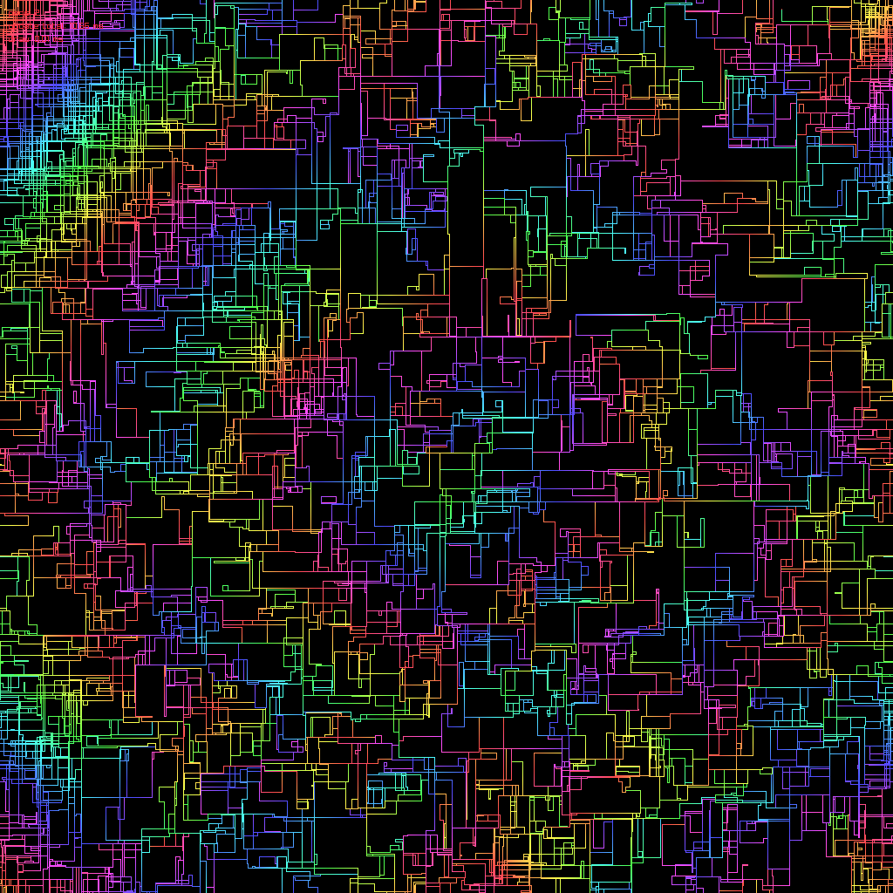

# Branches

Paint an endless loop of pretty patterns in a 1024x1024 canvas.

Compilation requires [raylib](https://github.com/raysan5/raylib). Project built with Visual Studio 2017. Yes, the code is ugly, I made this in a single evening, ok?

